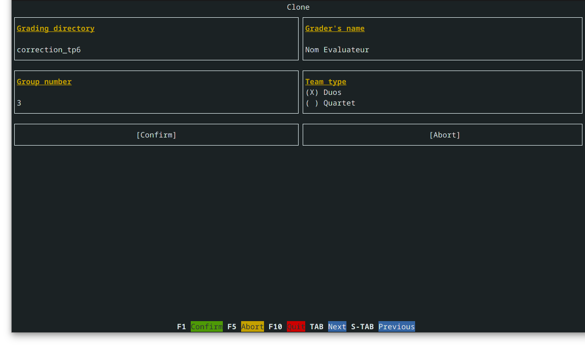
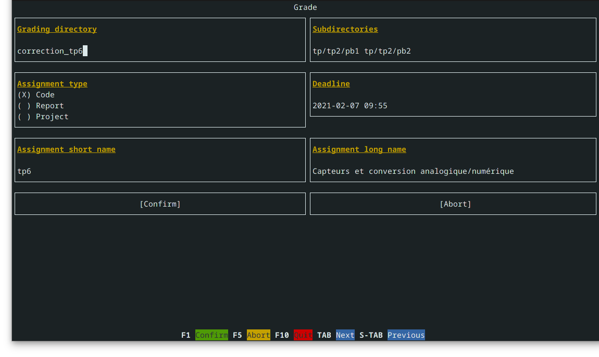
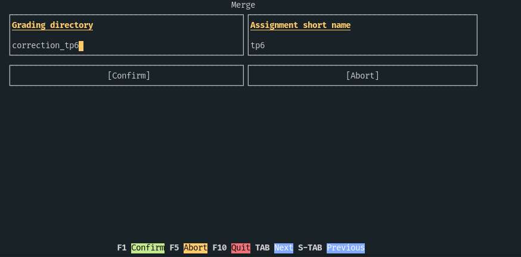
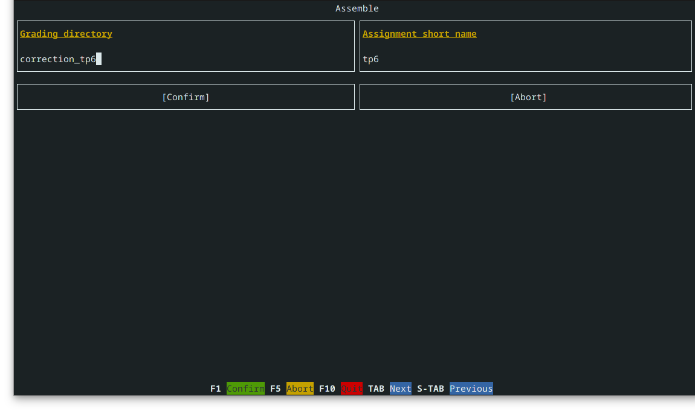
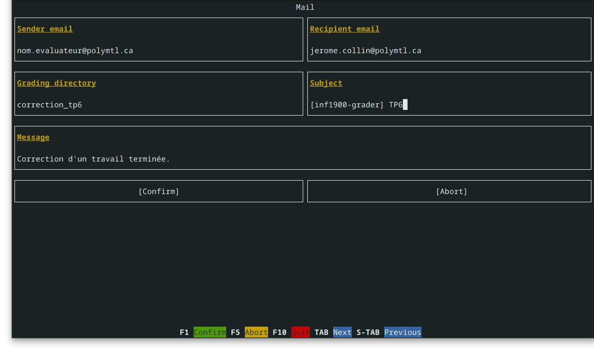

# Prérequis
- `$ git config --global credential.helper store`
- `$ git config --global user.name "Votre Nom"`
- `$ git config --global user.email prenom.nom@polymtl.ca`
- `$ pip3 install --user -r requirements.txt`
- [Outils AVR](http://www.groupes.polymtl.ca/inf1900/fichiers/)

> :warning: Notez que la commande `$ git config --global credential.helper store` sauvegarde vos informations (id et mdp) en texte dans le fichier `~/.git-credentials`. Vous pouvez supprimer le fichier à la fin de l'utilisation ou pour plus de sécurité, utiliser un keyring.

# Comment ça marche
- Lancez le script `./grader`.
- Suivez les étapes dans l'ordre dans lequel elles sont présentées.

> :information_source: Pour la première utilisation, après avoir fait la commande `$ git config --global credential.helper store`, clonez un répertoire d'étudiant manuellement, entrez vos informations et suprimez le par la suite, sinon vous ne réussirez pas à utiliser le `./grader`.

# Résumé des différentes étapes
## clone
- `clone` récupérera les informations des élèves (nom, prénom, équipe,
  groupe) depuis le site du cours et clonera le repo de chaque équipe.
  

## grade
- `grade` vérifiera les fichiers inutiles, compilera le code des
  élèves et écrira un fichier de notes dans chaque repo.  Il faut
  attribuer les notes manuellement, mais la majorité du travail
  répétitif est déjà automatisée.
  

## merge
- `merge` pushera un commit sur le master de chaque repo des équipes de
 la section à corriger.
  

## assemble
- `assemble` générera un fichier de notes `notes-inf1900-sectionXX-nom_travail.csv`
 à partir des notes entrées par le correcteur.
  
  
## mail
- `mail` enverra un email à Jérôme et joindra le fichier de notes `csv`.
  

# Ce qui manque
- Intégration à `clang-format` et `clang-tidy`.
- Simuler les programmes des étudiants à l'aide de `simavr`.
